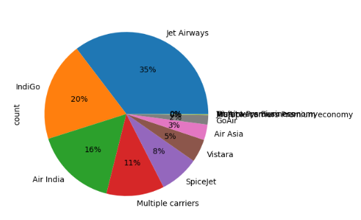
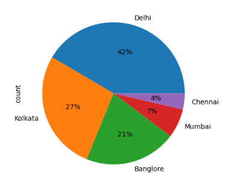
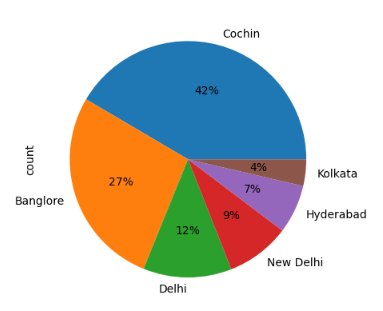
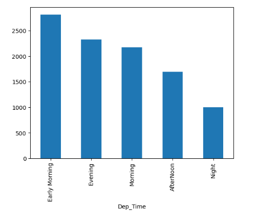
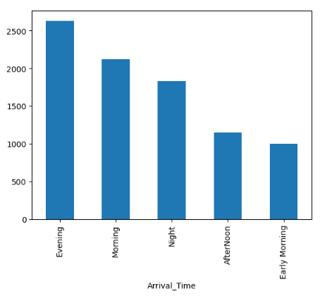
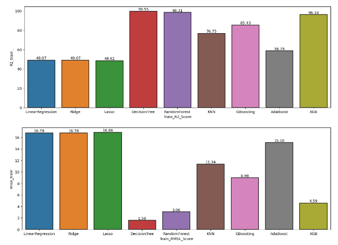
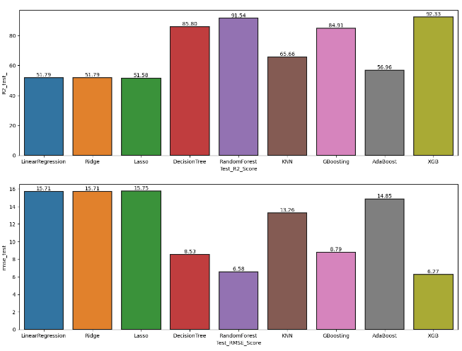
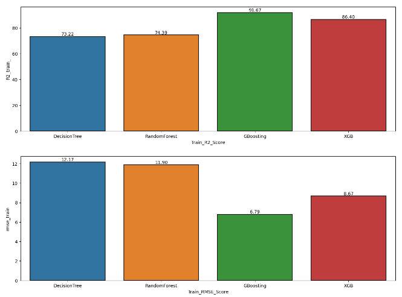
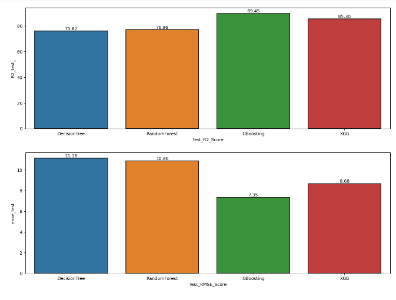

# Flight Price Prediction Report

## Introduction
This report presents the analysis and prediction of flight prices using various machine learning algorithms. The dataset contains information about flights including airline, source, destination, departure time, arrival time, duration, number of stops, and price. The objective is to build a predictive model that accurately estimates flight prices based on the provided features.

## Data Overview
1. The dataset consists of 10,683 entries and 11 columns.
2. There are both numerical and categorical columns.
3. Preliminary exploration reveals missing values in the 'Route' and 'Total_Stops' columns, and some duplicate entries.

## Data Cleaning
1. Removal of duplicate values: 220 duplicated entries were identified and removed from the dataset.
2. Treatment of null values: Since only 2 entries had missing values, they were dropped from the dataset.
3. Data transformation:
   - Converted 'Dep_Time' and 'Arrival_Time' columns to datetime objects and extracted hour values.
   - Categorized departure and arrival times into time intervals (e.g., Early Morning, Morning, Afternoon, Evening, Night).
   - Converted the 'Duration' column to minutes and dropped the original column.
   - Extracted date, month, and year from the 'Date_of_Journey' column.

## Exploratory Data Analysis (EDA)
1. Most Preferred Airline:
   - Jet Airways is the most preferred airline, with a preference of 35%.
     

2. Majority of Flights Take Off from:
   - Delhi is the source of the majority of flights, accounting for approximately 42%.
     
3. Maximum Flights Land in:
   - Cochin Airport is the most common destination, with about 42% of flights landing there.
     

## Impact of Independent Features on Price
1. Highest Priced Airline:
   - Jet Airways Business has the highest price, with a maximum fare of 79,512.
2. Business Class Flights:
   - Identified flights priced higher than 50,000, with Jet Airways Business having the majority.
3. Preferred Arrival and Departure Times:
   - Customers prefer flights with evening arrival times and early morning departure times.
      

## Model Building
1. Trained various regression algorithms including Linear Regression, Ridge Regression, Lasso Regression, Decision Tree Regressor, Random Forest Regressor, K-Nearest Neighbors (KNN), Gradient Boosting Regressor, AdaBoost Regressor, and XGBoost Regressor.
2. Evaluated models based on R2 score and root mean square error (RMSE) on both training and testing datasets.

## Model Evaluation

1. Decision Tree and Random Forest models showed good fit on both train and test data but surpassed the RMSE threshold.
2. Gradient Boosting and XGBoosting models achieved good R2 scores and RMSE values below 10, indicating better generalization.

## Model Fine-Tuning
1. Utilized GridSearchCV to fine-tune hyperparameters for Decision Tree, Random Forest, Gradient Boosting, and XGBoosting models.
   
   

## Final Model Selection
1. Selected the XGBoost Regressor model for its balanced performance on both training and testing datasets.

## Model Performance
1. Achieved an R2 score of 86.4% on the training dataset and 85.3% on the testing dataset.
2. RMSE values of 8.67 and 8.68 were obtained for the training and testing datasets, respectively.

## Conclusion
The XGBoost Regressor model demonstrates promising performance in predicting flight prices. Further refinement and optimization of the model may lead to even better accuracy and generalization. This concludes the report on flight price prediction using machine learning algorithms.
